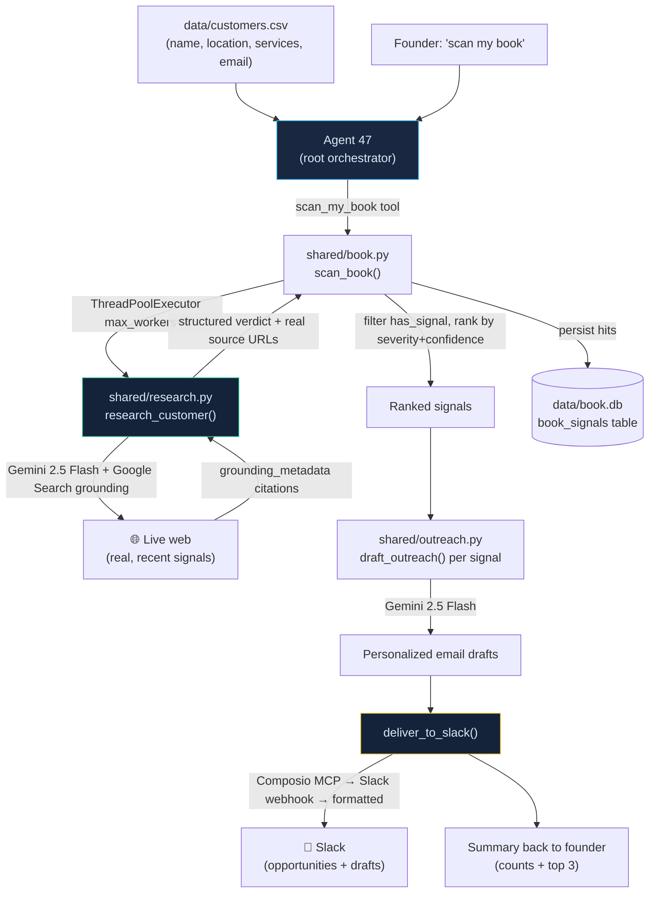

# Architecture — Agent 47

Agent 47 is a Google ADK 2.0 multi-agent system on an all-Gemini stack. The founder talks to
**one** root agent; it delegates to four specialists and owns a set of manager tools. The
flagship capability — **"scan my book"** — turns past customers into warm outreach using live,
grounded web research.

## The "scan my book" flow



## Agents (Google ADK)

```
Agent 47 (root)  ── tools: add_client, list_clients, dispatch_plan, list_plans, get_plan, scan_my_book
   ├── Onboarding        (discovery / scoping / kickoff)
   ├── Account Manager   (ongoing client work)
   ├── Intelligence      (signal monitoring; tools over shared/signals.py)
   └── Execution         (real actions via Composio MCP — Gmail/Calendar/Slack/500+)
```

## New modules (this build)

| Module | Responsibility |
|---|---|
| `shared/research.py` | `research_customer()` — Gemini + **Google Search grounding**; returns `{has_signal, signal_type, severity, summary, evidence:[{claim, source_url}], confidence}`. Real URLs pulled from `grounding_metadata`. Retry/backoff on 503s; never crashes. |
| `shared/book.py` | `load_customers()` (CSV), `scan_book()` (concurrent research over the book, rank, persist), `BookStore` (new `book_signals` SQLite table — separate from the orchestrator schema). |
| `shared/outreach.py` | `draft_outreach()` (personalized email), `deliver_to_slack()` (Composio → webhook → formatted, always completes), `scan_and_deliver()` (end-to-end pipeline). |
| `orchestrator/tools.py` | `scan_my_book()` manager tool added to `MANAGER_TOOLS`. |
| `scripts/scan.py` | Headless `python -m scripts.scan` / `make scan` demo runner with a clean table. |

## Key design decisions

- **Grounding for trust.** Source URLs come from `response.candidates[0].grounding_metadata`,
  not the model's prose — so evidence is real and clickable on camera.
- **Grounding ≠ JSON mode.** Google Search grounding can't be combined with `response_schema`,
  so the model emits a JSON block in text; we parse it tolerantly and enrich with grounded URLs.
- **Low concurrency + retry.** Free-tier `gemini-2.5-flash` throttles hard; `max_workers=4`
  plus per-call exponential backoff absorbs 503 spikes. Any failure becomes a data field,
  never an exception.
- **Always completes.** Slack delivery degrades Composio → Slack webhook → formatted blocks,
  so the demo never dead-ends.
- **Additive & safe.** New modules only; `shared/signals.py` and the `orchestrator/` store are
  untouched. All 77 original tests still pass (101 total).

## Tech

Google ADK 2.0 · Gemini 2.5 Flash · Google Search grounding (google-genai 1.75) ·
Composio MCP Tool Router · SQLite · `concurrent.futures` · Python 3.12.
