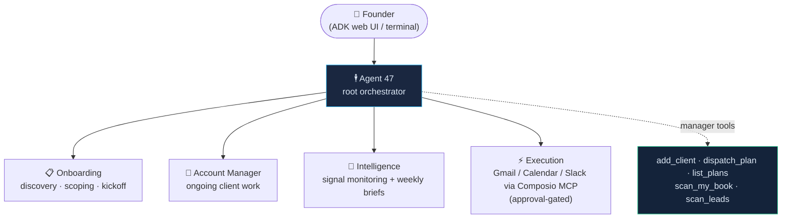
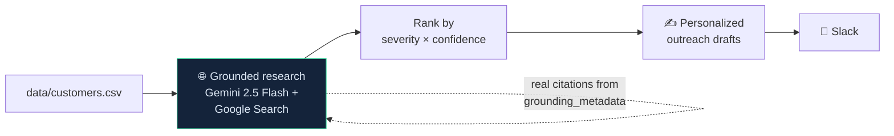
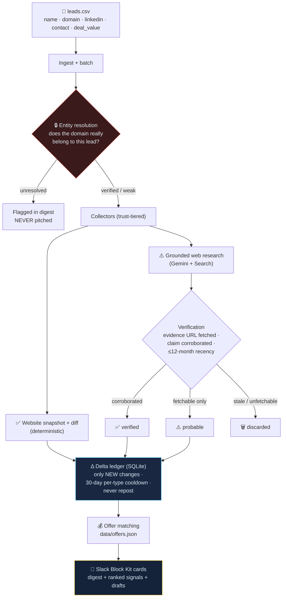

# 🕴️ Agent 47 — SDR Agent

**An AI operations agent that turns your past customers and dormant leads into warm pipeline.**

Built for the **Google for Startups AI Agents Challenge** · Live at [agent47.tech](https://agent47.tech)

<p align="center">
  
</p>

Drop your lead list into the chat (Excel works — no exporting, no formatting), tell the agent what you sell, and say *"scan my leads."* It researches every business **live on the web** (Gemini + Google Search grounding), verifies what it finds, detects what *changed* since the last scan, matches each signal to a service you actually sell, drafts the outreach, and streams its progress into Slack as it works — finishing with ranked opportunity cards.

> Live run on 8 real medspa/dental businesses: surfaced verified signals like *"SkinSpirit opened its 60th location in Princeton, NJ"* and *"Heartland Dental acquired Smile Design Dentistry (+60 offices)"* — each with a clickable source, a matched service offer, and a ready-to-send email.

---

## Why this matters (the business case)

Agencies sit on a goldmine they ignore: **past customers and closed-lost leads**. A former client who just opened their 100th location or raised funding is the warmest lead you can get — but nobody manually Googles every old account every week. The signal is public; the labor isn't worth it. Agent 47 automates exactly that unscalable part:

```
existing database → live research → verified change → matched offer → outreach → Slack
```

Re-engaging existing contacts costs $0 in acquisition and converts 2–5× better than cold outreach.

---

## Architecture

### The agent system (Google ADK 2.0)



One root agent the founder talks to; four specialists it delegates to; a set of manager tools that run the two research pipelines.

### Pipeline 1 — `scan_my_book` (past customers → outreach)



### Pipeline 2 — `scan_leads` (the SDR engine: verified, delta-aware, offer-matched)



**The three correctness guarantees** (each one exists because we caught the failure live):

| Guarantee | Mechanism | The failure it prevents |
|---|---|---|
| Right business | Entity-resolution gate (domain ⇄ name/location match) | Pitching based on a same-named stranger's news |
| Real, fresh facts | Trust tiers: deterministic diff > corroborated grounding > probable; recency check | Congratulating someone on stale or hallucinated news |
| Never repeats | Delta ledger + summary-hash dedupe + per-(lead, type) 30-day cooldown; volatile-widget scrubbing | Spamming the same signal, or "signals" from a store-hours widget re-rendering |

### Signal → Offer matching

| Signal detected | Matched service (configurable in `data/offers.json`) |
|---|---|
| New location / clinic opened | GBP / Google Maps setup + Local SEO |
| New machine / service launched | Service landing page + Google Ads |
| Reviews / rating falling | Reputation management |
| Hiring front-desk / admin staff | AI receptionist / front-desk automation |
| No online booking detected | Booking automation |

---

## Quick start

```bash
python3 -m venv .venv && source .venv/bin/activate
cp .env.example .env        # add GEMINI_API_KEY (aistudio.google.com/apikey)
make install
```

| Command | What it does |
|---|---|
| `make web` | ADK web UI at `:8001` — chat with Agent 47 (*"scan my book"*, *"scan my leads"*) |
| `make run` | Chat with Agent 47 in the terminal |
| `make scan` | Headless Pipeline 1: customers → research → drafts → Slack |
| `make sdr-scan` | Headless Pipeline 2: leads → verify → delta → offers → Block Kit cards |
| `make test` | Full offline test suite (179 tests, no API calls) |

### Built for everyone, not just developers

- **Drop your Excel/CSV file straight into the chat** — headers from any CRM are mapped
  automatically (Company→name, Website→domain, First/Last name→contact). No exporting,
  no pasting, no formats to learn.
- **Tell the agent what you sell in plain words** — it builds your offer catalog itself.
- **Watch it work:** scans stream live progress into Slack
  (`🔍 scan started… 🚀 SkinSpirit — signal found ✅ … 📊 done`) instead of a silent spinner.
- **Digest on your phone:** optional Telegram delivery, set up in 2 minutes via @BotFather.

### Environment variables

| Variable | Required | Purpose |
|---|---|---|
| `GEMINI_API_KEY` | ✅ | All research + drafting (Gemini 2.5 Flash) |
| `SLACK_WEBHOOK_URL` | recommended | Real Slack delivery (Block Kit cards + live progress). Without it, pipelines still complete and print formatted output |
| `SLACK_CHANNEL` | optional | Label for delivery reports (default `#general`) |
| `TELEGRAM_BOT_TOKEN` / `TELEGRAM_CHAT_ID` | optional | Scan digests on your phone (@BotFather token + @userinfobot chat id) |
| `COMPOSIO_API_KEY` / `COMPOSIO_USER_ID` | optional | Execution agent's real tools (Gmail / Calendar / Slack / 500+ apps via MCP) |
| `GEMINI_MODEL`, `SDR_DB_PATH`, `MOU_DB_PATH` | optional | Overrides |

---

## Project structure

```
agents/            # ADK agents: agent47 (root) + onboarding, account_manager,
                   #   intelligence (signal tools), execution (Composio MCP)
orchestrator/      # manager layer: SQLite store, tool-free Gemini planner,
                   #   dispatcher, Gemini-CLI build worker, MANAGER_TOOLS
sdr/               # the SDR engine: store (delta ledger) · ingest · resolve ·
                   #   collect (diff + grounded) · verify · offers · pipeline · slack
shared/            # research.py (Google Search grounding), outreach.py,
                   #   signals.py, config.py, prompts/*.md
scripts/           # headless runners: scan.py, sdr_scan.py
data/              # customers.csv, leads.csv, offers.json (+ gitignored SQLite)
tests/             # 146 offline tests (fakes/fixtures, zero API calls)
docs/superpowers/  # design specs + implementation plans
```

## How the research stays honest

- **Citations are real:** source URLs come from Gemini's `grounding_metadata` (the actual Google Search results used), never from model free-text.
- **Search grounding can't be combined with JSON mode**, so the model emits a JSON block that's parsed tolerantly and then enriched with the grounded URLs.
- **Everything degrades gracefully:** every collector/verifier returns data or an error field — a throttled API call (free-tier 503s are common) becomes a counted error, never a crash; Slack falls back webhook → formatted text; a batch always finishes and always reports.

## Testing

```bash
make test                                   # 146 tests, all offline
RUN_GEMINI_SMOKE=1 .venv/bin/pytest -q      # + opt-in live API smoke
```

Tests use injected fakes for every external surface (Gemini client, page fetcher, Slack poster) — including a thread-safety hammer test on the shared SQLite store and end-to-end pipeline tests proving the dedupe/cooldown behavior.

## Docs

- [ARCHITECTURE.md](ARCHITECTURE.md) — pipeline internals + design decisions
- [DEVPOST.md](DEVPOST.md) — hackathon submission write-up (problem, solution, rubric)
- [docs/superpowers/specs/](docs/superpowers/specs/) — the SDR agent design spec
- [docs/superpowers/plans/](docs/superpowers/plans/) — the TDD implementation plan it was built from

## Stack

Google ADK 2.0 · Gemini 2.5 Flash · Google Search grounding (`google-genai`) · Composio MCP Tool Router · SQLite (stdlib) · Slack Block Kit · Python 3.12 · pytest
